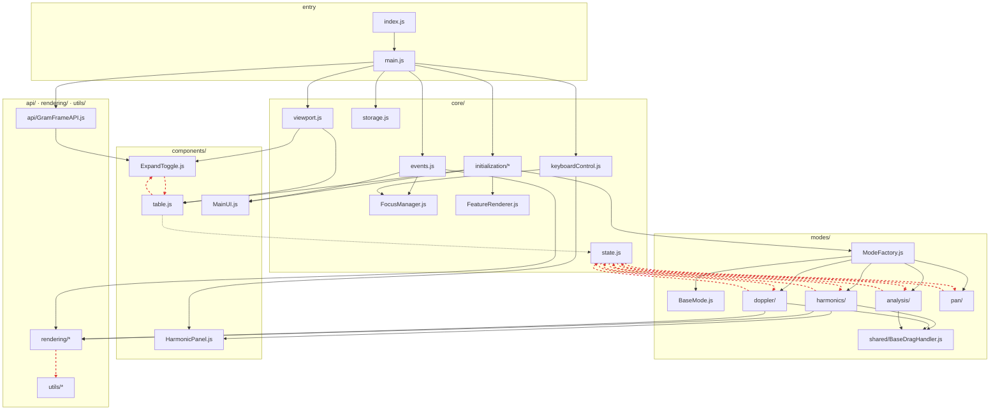
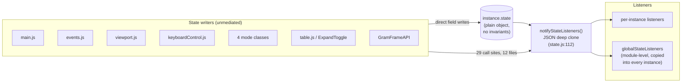
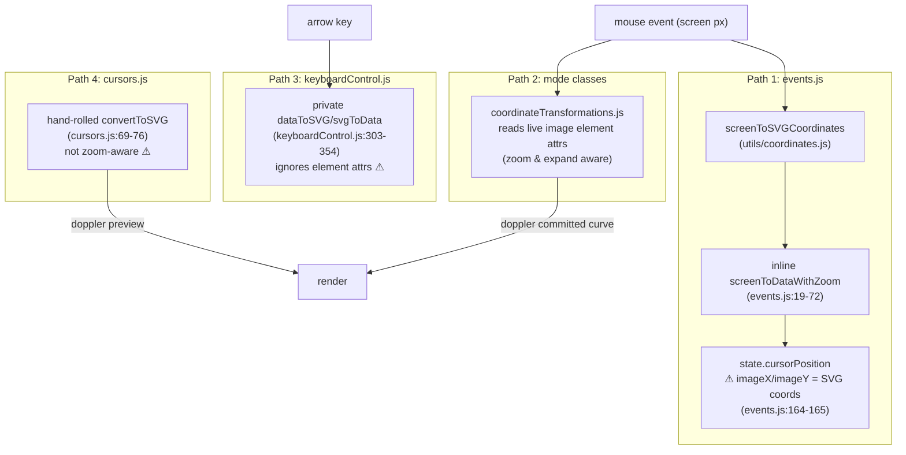

# GramFrame Architecture & Implementation Audit

**Date:** 2026-07-23 · **Scope:** architecture & module boundaries, code quality & maintainability, testing strategy, implementation strategy & process, documentation drift · **Companion document:** [Findings-Register.md](Findings-Register.md) (ranked, independently verified findings, referenced below as GF-nn)

---

## 1. Executive summary

GramFrame is in better shape than most codebases of its history: the once-monolithic 2,100-line `main.js` has genuinely been refactored down to 562 lines, all 147 Playwright tests pass on a clean checkout, `tsc` typechecking is clean, TODO/FIXME debt is essentially zero, and several modules (`rendering/symbols.js`, `utils/harmonicSampling.js`, `core/storage.js`'s schema/TTL design, the release pipeline) are exemplary. The mode system's *concept* — four modes behind a `BaseMode` contract, instantiated by a factory, with `FeatureRenderer` as the cross-mode rendering seam — is sound.

The audit's critical verdict is that **the boundaries drawn on the whiteboard do not exist in the code**. Every mode, component, and core module reaches freely through the `GramFrame` instance (347 accesses to `instance.state` across 19 files), state mutation and broadcast are scattered across 12 files, and `core/state.js` imports every mode class while every mode imports state back — 8 circular dependencies. The most dangerous concrete consequence is the coordinate pipeline: the screen→SVG→image→data transform exists in **four divergent implementations**, and the keyboard path uses different math than the mouse path under zoom/expand (GF-01). Meanwhile the verification layer has quietly eroded: null-safety typechecks are disabled, there is no linting, no unit-test lane, the multi-instance keyboard/focus specs are disabled without explanation, and a production failure mode exists where a broken mode silently degrades to a no-op (GF-04).

Documentation splits into two tiers: `Tech-Architecture.md` and `Data-and-State-Guide.md` are accurate and current, but CLAUDE.md, README, `Gram-Modes.md`, and several accepted ADRs describe a three-mode (or two-mode) system from an earlier era — and ADR-015 describes a zoom design that is the opposite of what the code does (GF-39).

### Top five risks

| # | Risk | Findings |
|---|------|----------|
| 1 | Four divergent coordinate-transform implementations; keyboard vs mouse math disagrees under zoom/expand | GF-01, GF-02, GF-21 |
| 2 | Silent production degradation: mode-construction failure yields a no-op spectrogram; storage failures swallow annotation loss | GF-04, GF-16 |
| 3 | No enforced boundaries: god-object instance + state⇄modes import cycles + diffuse mutation/broadcast make every change a whole-system change | GF-03, GF-05, GF-06, GF-08 |
| 4 | Verification erosion: null checks off, no lint, no unit lane, keyboard/focus coverage disabled, 142 fixed sleeps masked by CI retries | GF-25–GF-27, GF-31, GF-32 |
| 5 | Doc drift misleading humans and AI agents alike: CLAUDE.md points at phantom files; two ADRs describe fictional designs | GF-38–GF-43 |

---

## 2. System overview

GramFrame scans the page for `<table class="gram-config">` elements, replaces each with an SVG-based interactive spectrogram, and exposes a listener API for host pages. A `GramFrame` class instance per table owns a plain-object state tree; four interaction modes (pan, analysis, harmonics, doppler) extend `BaseMode` and are created by `ModeFactory`; `FeatureRenderer` composes each mode's persistent features into one render pass.

### 2.1 Module dependency graph

Directory-aggregated from `madge --json` (46 files, 102 import edges). Red dashed edges participate in the 8 reported circular dependencies.



The cycles decompose into two knots (GF-03, GF-09):

1. **`state.js` ⇄ every mode** — `state.js:10-13` imports all four mode classes to assemble initial state, while each mode imports `notifyStateListeners` back and self-broadcasts.
2. **`table.js` ⇄ `ExpandToggle.js`** (plus chains through `table.js → state.js → modes`) — `table.js` mounts the toggle after image load; the toggle re-runs layout/axes that live in `table.js`.

### 2.2 Mode-switch lifecycle

From `main.js:403-493` (`_switchMode`):

```mermaid
sequenceDiagram
    participant UI as Mode button
    participant GF as GramFrame (main.js)
    participant Old as Old mode
    participant New as New mode
    participant FR as FeatureRenderer
    participant L as State listeners

    UI->>GF: _switchMode(mode)
    Note over GF: guard: pan requires zoom > 1:1 (main.js:405)
    GF->>GF: state.previousMode = mode; state.mode = new; clear dragState
    GF->>GF: update button classes + container mode class
    GF->>Old: cleanup()
    GF->>Old: deactivate()
    GF->>New: activate()
    GF->>New: getGuidanceText() → guidance panel
    GF->>New: updateLEDs(cursorPosition)
    GF->>GF: updateLEDDisplays, updatePersistentPanels
    GF->>FR: renderAllPersistentFeatures()
    GF->>L: notifyStateListeners(deep-cloned state)
```

The sequence itself is coherent. The problems are around it: sub-operations inside the switch also broadcast, so one gesture fires multiple full-state clones (GF-08), and `updatePersistentPanels` reaches into named sibling modes (GF-11).

### 2.3 State flow



There is no store, no setter path, no batching: any module writes any field and decides for itself whether to broadcast (GF-05, GF-08). The deep clone protects listeners from mutating internal state — a real strength — but runs on every mousemove (GF-07).

### 2.4 Coordinate pipeline — the four implementations



Path 2 (`coordinateTransformations.js`) is the well-designed one — it derives geometry from the live image element, which is exactly why markers stay locked to data coordinates across zoom+expand. Paths 1, 3, and 4 each re-derive the math differently; path 3 diverges from path 2 precisely when zoomed or expanded, and path 4 makes the Doppler live preview disagree with the committed curve under zoom (GF-01, GF-02, GF-21). **Consolidating on path 2 and deleting the others is the single highest-value refactor in this audit.**

---

## 3. Architecture & module boundaries

**What is good.** The mode-system shape is right: `BaseMode` as contract, `ModeFactory` as the single instantiation point with an explicit mode whitelist, `FeatureRenderer` clearing once and delegating per-mode with `has*Features()` guards (`FeatureRenderer.js:23-45`). Initial state is centrally composed from per-mode slices (`state.js:37-89`) — modes own their state shape. `FocusManager` correctly de-registers destroyed instances. The extraction of `core/initialization/`, `viewport.js`, and `storage.js` out of `main.js` was executed, not just planned.

**What is wrong.** The contract exists only by convention:

- **The instance is the architecture** (GF-05). `main.js:65-133` declares ~50 public fields; every layer reaches through `this.instance.*` for state, DOM nodes, LEDs, sibling modes, and zoom methods (HarmonicsMode alone: 105 references). Class methods are one-line forwarders to free functions that take the instance back (`main.js:203-252`) — the class is a namespace around a mutable bag.
- **State has writers everywhere and owners nowhere** (GF-06, GF-08, GF-12, GF-13). Six-plus modules write `state.*` fields directly; 29 broadcast call sites decide individually whether listeners hear about it; `_clearGram` hand-resets 13 fields instead of rebuilding from `createInitialState`; the module-level `globalStateListeners` array attaches every globally-registered listener to every instance on the page.
- **The dependency graph runs backwards** (GF-03, GF-09). `state.js` (a core leaf by intent) imports all four mode classes; `table.js` — nominally a component — owns zoom math, visible-range computation, and the axis engine, making it a hub that core and modes both import and putting it inside four cycles.
- **Modes are not islands** (GF-10, GF-11). `MainUI` calls named mode methods; `BaseMode` carries ~20 hooks of which two (`renderCursor`, `getStateSnapshot`) are overridden by no subclass and several overrides are empty.

None of this is fatal today — the tests pass and the component works. The cost is that every new feature must be threaded through an unbounded surface, and nothing in the mode layer can be tested without a live browser (see §5).

## 4. Code quality & maintainability

**What is good.** Zero TODO/FIXME debt. `symbols.js` is a model module: pure factory, documented contract, safe fallback, reused by three consumers. `harmonicSampling.js` has a documented purity contract and a bounded generation loop. The row-diffing table updates (both copies of them) correctly avoid DOM teardown. The storage layer's schema-version guard, fail-safe TTL expiry, and additive migration (`storage.js:185-230`) show real forward-compatibility thinking. `configuration.js` + `GramFrameAPI` fail loud with a styled per-table error indicator — the correct pattern the rest of the code should copy.

**What is wrong.**

- **Silent failure as policy** (GF-04, GF-16). `ModeFactory` returns a do-nothing `BaseMode` in production when a mode fails to construct — interaction dies with only a console warning; the localhost hostname check conflates "dev" with a deployment topology. The storage layer's bare `catch {}` blocks mean a student's annotations can fail to save with no signal. Test hooks (`__test__*`) ship on the production API (GF-23), and the API keeps two disagreeing instance registries (GF-24).
- **Duplication with divergence.** Beyond coordinates: PanMode hand-rolls drag while three modes use `BaseDragHandler` — and those three each run a *second* manual drag machine for creation/placement gestures (GF-18); drag state is double-bookkept between handler and state tree "for backward compatibility" (GF-17); Doppler hit-testing repeats one comparison three times while `tolerance.js` helpers go unused (GF-19); the markers table and harmonics panel maintain the same diffing algorithm twice (GF-20).
- **Dead weight** (GF-22). Three never-called DopplerMode methods, the deprecated `zoom.panMode` flag still in the published state type, a vestigial counter, a helper file imported by zero specs, and 15 modules with unused exports per `ts-unused-exports`.
- **Hot-path waste** (GF-07, GF-15). Full-state JSON clone per mousemove; a dynamic `import()` with an empty catch inside the arrow-key handler.

## 5. Testing strategy

**What is good.** 147/147 tests pass on a clean checkout (1.7 min, 2 workers). `harmonic-sampling-unit.spec.js` is genuinely well-designed boundary testing. The `gram-frame-page.js` page object is a solid pattern with state-based waiting; `state-assertions.js` provides reusable structural validators. Behavioral storage coverage (23 tests incl. TTL, schema-version discard, storage-unavailable degradation) is thorough.

**What is wrong.**

- **Everything rides the browser** (GF-25). `playwright test` is the only runner; the pure math (doppler, tolerance, sampling, coordinates) has no fast lane. The 9 pure-JS sampling assertions boot Vite + Chromium. Adding unit tests is structurally discouraged — and §3 explains why: modes can't be constructed without faking the entire instance.
- **The most fragile code is the least covered** (GF-26, GF-30). The two disabled `keyboard-focus` specs were the only behavioral coverage of arrow-key marker movement and multi-instance focus isolation — disabled without a comment, replaced by smoke tests. That is precisely where the divergent keyboard coordinate math (GF-01) hides. PanMode is the only mode with no dedicated spec; zoom clamping is untested.
- **Flakiness is being managed, not fixed** (GF-27, GF-28). 142 `waitForTimeout` calls — some baked into the page object — with CI `retries: 2` absorbing the fallout. The good POM is used by 3 of 19 specs; the rest hand-roll selectors.
- **Claimed coverage that doesn't exist** (GF-29). "Screenshot comparisons for UI consistency" appear in CLAUDE.md; the suite contains zero `toHaveScreenshot`/`toMatchSnapshot` calls.

## 6. Implementation strategy & process

**What is good.** The zero-runtime-dependency stance is real and appropriate for the `file://` field-deployment model; the standalone IIFE build with inlined CSS (vite.config.js) serves it well. The release pipeline validates semver, checks `version.js` consistency, asserts bundle size, and runs the full gate before publishing; PR previews deploy per-PR with cleanup. Unminified output (ADR-010) is a defensible field-debugging choice. The spec-kit workflow (`specs/154`–`158`) produces genuinely traceable feature records.

**What is wrong.**

- **The gate has holes** (GF-31, GF-32, GF-34). No ESLint at all; `strictNullChecks` and `noImplicitAny` disabled in the project's *only* type defense; CI never builds the standalone bundle that is the actual shipped artifact, tests chromium-only, and pins EOL Node 18 against `@types/node ^24`.
- **Hygiene tooling is decorative** (GF-33). `madge`, `ts-unused-exports`, and `unimported` sit in devDependencies with no script or CI step — the 8 cycles and 15 dead-export modules they would have flagged went unnoticed.
- **Friction that invites bypass** (GF-35, GF-37). Pre-push runs the full browser suite; `generate-version` dirties the tracked `src/utils/version.js` on every test/build run (observed twice during this audit).
- **The repo carries its own scaffolding** (GF-36). ~750 KB of agent-process artifacts (`prompts/`, `Memory/`, `Memory_Bank.md`, `Implementation_Plan.md`), a committed Playwright report despite `.gitignore`, an `.obsidian/` vault, and the unreferenced `zoom-demonstrator/` prototype whose files shadow real module names.

## 7. Documentation drift

The docs are two-tier. **Accurate tier:** `Tech-Architecture.md` (four modes, correct file tree, correct axis-rendering attribution) and `Data-and-State-Guide.md` (correct state shape, zoom object, deep-copy semantics) — these should be canonical. README's storage/context section is also accurate and well-written.

**Drifted tier** — the pattern is consistent: two real, completed refactors (three→four modes; monolith→modular main.js) updated the code and the new docs but not the old ones:

- **CLAUDE.md** (GF-38): three modes claimed, phantom `src/rendering/axes.js` listed, ~15 real modules missing, nonexistent test files cited, nonexistent visual testing claimed. This is the file AI agents are told to trust.
- **ADR-015** (GF-39): mandates viewBox-based zoom with "No Image Transforms"; the code keeps the viewBox fixed and resizes the image element — the rejected alternative is what shipped.
- **ADR-011** (GF-40): every FeatureRenderer method name it documents is fictional.
- **`Gram-Modes.md`** (GF-41): describes *two* modes. **`Testing-Strategy.md`** (GF-42): prescribes a Jest/80%-coverage regime that has never existed.
- Mode-count drift replicates across README, ADR-008, and test helpers; ADR numbering skips 014 (GF-43).

For a training-materials project whose docs are read by both new contributors and AI coding agents, stale ADRs are not cosmetic: they are actively wrong instructions.

---

## 8. Recommendations roadmap

Sequenced so each step unblocks the next. Effort: S ≤ half day, M ≤ 3 days, L > 3 days.

**Stage 1 — Stop the bleeding (all S).**
1. Fail loud in `ModeFactory` — reuse the error-indicator pattern; drop the hostname check (GF-04).
2. Surface storage save failures to the UI (GF-16).
3. Fix or remove the knowingly-wrong `imageX/imageY` (GF-02).
4. Remove listener leaks: bound handler refs + uninstall global keydown at zero instances (GF-14).
5. Wire `madge --circular` and `ts-unused-exports` into CI as a ratchet: fail on *new* cycles/dead exports (GF-33).
6. Un-track generated/foreign files: `playwright-report/`, `.obsidian/`, version churn (GF-36, GF-37).

**Stage 2 — One coordinate pipeline (M).**
7. Consolidate on `coordinateTransformations.js`; delete the keyboardControl privates, the events.js inline transform, and the cursors.js `convertToSVG`; port callers (GF-01, GF-21).
8. Add Vitest as a dev-only unit lane (zero-runtime-dep stance unaffected) and land transform unit tests *with* the consolidation; move the sampling unit spec there (GF-25).
9. Re-enable the keyboard-focus specs against the unified pipeline (GF-26).

**Stage 3 — State discipline (M each).**
10. Break the state⇄modes cycle: modes register initial-state slices via ModeFactory; single notification dispatcher with microtask batching; throttle mousemove broadcasts (GF-03, GF-07, GF-08).
11. Replace `globalStateListeners` auto-copy with explicit per-instance subscription (GF-06).
12. Rebuild `_clearGram` from `createInitialState` (GF-12).

**Stage 4 — Split the hub, converge duplication (M each).**
13. Split `table.js` into layout/axes/image-setup modules — the ExpandToggle cycle dissolves as a side effect (GF-09).
14. Port PanMode to `BaseDragHandler`; extend it to cover creation/placement gestures; delete the double-bookkept drag state (GF-17, GF-18).
15. Extract one row-diffing table component; adopt `tolerance.js` helpers in Doppler (GF-19, GF-20).

**Stage 5 — Tighten the gate (S–M).**
16. ESLint + CI step (GF-31); enable `strictNullChecks`/`noImplicitAny` with a staged burn-down (GF-32).
17. CI: add `build:standalone`, bump Node, consider a WebKit smoke job (GF-34); slim pre-push to typecheck + unit lane (GF-35).
18. Replace `waitForTimeout` with state-based waits, POM-ify remaining specs, then drop CI retries (GF-27, GF-28).

**Stage 6 — Docs sweep (all S).**
19. Regenerate CLAUDE.md's structure/mode sections (GF-38); rewrite ADR-015 and ADR-011 to match reality (GF-39, GF-40); fix or fold `Gram-Modes.md` and `Testing-Strategy.md` (GF-41, GF-42); one pass for the mode-count stragglers (GF-43); banner the completed refactoring doc (GF-44).

The god-object itself (GF-05, L) is deliberately *not* an early stage: stages 2–4 shrink its surface organically, and a big-bang "introduce a store" refactor before the pipeline and cycles are fixed would churn every file at once.

---

## Appendix A — Method

Evidence was gathered by running the toolchain on a clean checkout (`tsc --noEmit`: clean; full Playwright suite: 147/147 passing in 1.7 min; `madge --circular`: 8 cycles; `ts-unused-exports`: 15 modules; `unimported`: 1 file) and by three parallel deep-read passes (core/state layer; mode system/components/rendering; tests/process/docs), every claim carrying `file:line` evidence.

## Appendix B — Independent review methodology

Every finding in the [register](Findings-Register.md) was then adversarially verified by **independent reviewer agents running on a different Claude model (Opus) than the author**, each given only the bare claim and repository access — no access to the author's reasoning — and instructed to attempt refutation. Critical/High findings received three verifiers with distinct lenses (factual correctness; independent reproducibility; severity calibration) and required a 2-of-3 confirmation majority; Medium/Low findings received one verifier each. Verdicts, including refutations and severity adjustments, are recorded per-row in the register's **Verified** column; refuted findings are disclosed there rather than silently dropped.

<!-- REVIEW-STATS: to be filled after verification -->
