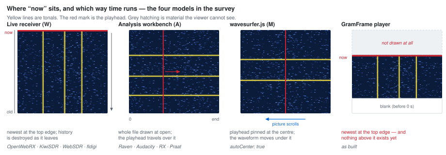
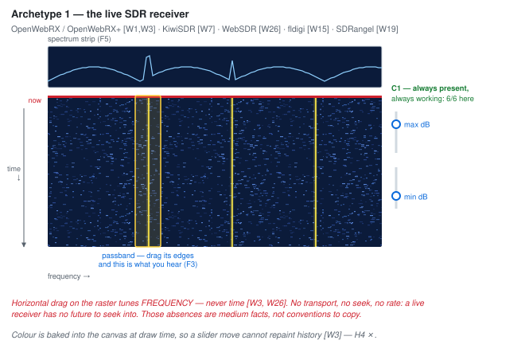
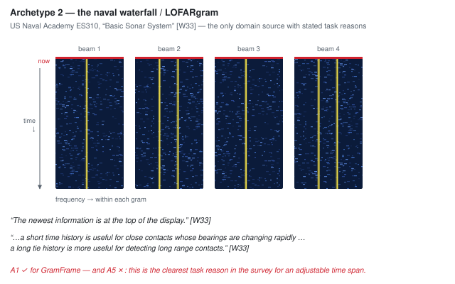
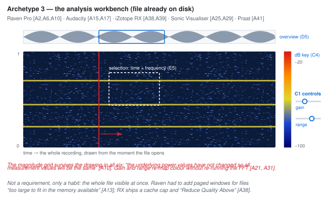
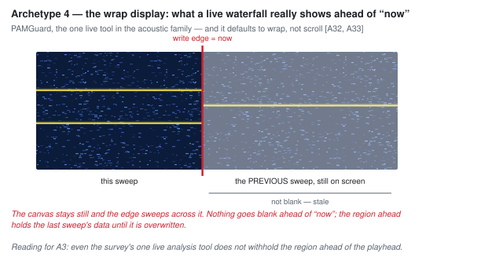
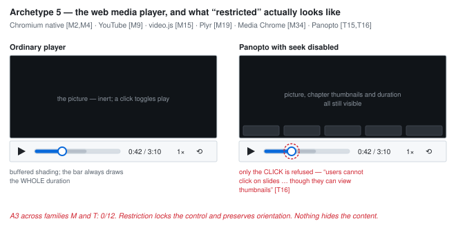
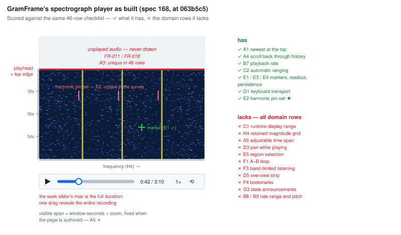
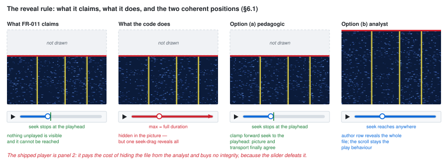
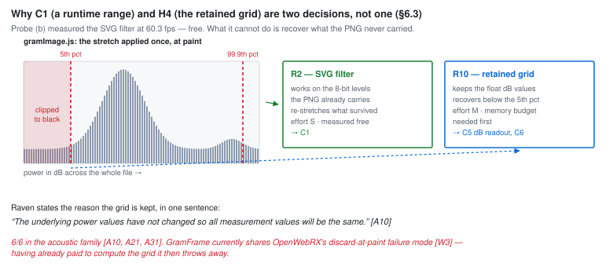

# Precedent gallery — spectrograph player (feature 169)

**Date**: 2026-09-05 · **Companion to**: [research.md](./research.md) · **Status**: complete

A visual companion to the survey. It has three parts: **schematics** I drew of the
layout archetypes (§1), a **link gallery** to the canonical published screenshot of
every system that was actually read (§2), and a list of **systems that were not
surveyed** but would be worth a look if this is ever revisited (§3).

## Why links rather than embedded screenshots

Most of these products are commercial, and their interface screenshots are
copyrighted; several open-source ones carry documentation licences that a bare copy
into this repository would not satisfy. §2 therefore links to each vendor's or
project's own page and says which figure to look at, rather than reproducing it. The
schematics in §1 are original drawings, so they carry no such constraint — and for
comparing *layouts* they are the more useful artefact anyway, because they strip out
the branding, the toolbars and the platform chrome that make two identical designs
look different.

**Provenance rule.** Every URL in §2 was fetched and read during the survey and
appears in the evidence log (research.md §8.3). **URLs in §3 were not fetched** and
are given as starting points only; they are marked as such.

---

## 1. Schematics — the layout archetypes

Original diagrams. Row ids (A1, C1, H4 …) are the 46-row checklist; bracketed ids
(W33, A10 …) are evidence-log rows in research.md §8.3.

### 1.1 Where "now" sits, and which way time runs

The single most useful comparison in the survey: four different answers to the same
question, of which GramFrame's is the fourth.

### 1.2 Archetype 1 — the live SDR receiver

The closest *visual* precedent and the furthest *medium* precedent. Note what the
horizontal gesture is spent on, and that the level controls are always present.

### 1.3 Archetype 2 — the naval waterfall / LOFARgram

The only source in the whole survey that states *why* the display is shaped as it is.
It confirms interview decision 5 (newest at top) and it is the strongest argument
against `window-seconds` being fixed when the page is authored.

### 1.4 Archetype 3 — the analysis workbench

Where the analyst's conventions come from: a retained magnitude grid, a display range
in dB, a selection that is a box in time *and* frequency.

### 1.5 Archetype 4 — the wrap display

Worth its own diagram because it undermines an intuition. A live waterfall does *not*
go blank ahead of "now": it shows the previous sweep until it is overwritten. Even the
one live tool in the acoustic family does not withhold the region ahead of the playhead.

### 1.6 Archetype 5 — the web media player, and what "restricted" really means

The finding that decides §6.1: restriction in this family locks the *control* and
preserves the *orientation*. Nothing hides the content.

### 1.7 GramFrame's player, scored against the same checklist

### 1.8 The reveal rule: claimed, actual, and the two coherent positions

**Decided 2026-09-05 (research.md §9 Q1): option (b), the fourth panel.** The player
draws the whole gram from load; the scrolling, playhead-at-top view stays as what
happens during playback. The diagram is kept as drawn because panels 1–3 are the
argument that led there.

### 1.9 Why C1 and H4 are two decisions, not one

---

## 2. Link gallery — the systems that were surveyed

"Look for" names the figure or screenshot on the linked page and what it shows.

### 2.1 Sonar and SDR waterfalls

| System | Page with the imagery | Look for | Rows it evidences |
|---|---|---|---|
| OpenWebRX+ | [fms.komkon.org/OWRX/](http://fms.komkon.org/OWRX/) | The annotated full-client screenshot at the top: spectrum strip over waterfall, the two colour sliders top-right, the bookmark bar | A1, C1, C2, D1, F3 [W1, W2] |
| OpenWebRX | [github.com/jketterl/openwebrx](https://github.com/jketterl/openwebrx) | The README screenshot — same layout without the `+` additions | A1, A4, H4 ✗ [W3, W5] |
| KiwiSDR | [github.com/jks-prv/Beagle_SDR_GPS](https://github.com/jks-prv/Beagle_SDR_GPS) | The client screenshot; then the colour-key ("aperture") bar described in `web/extensions/colormap/colormap.js` | C1, C3, **C4** (the only real dB key in the family), G1 [W6, W9, W13] |
| WebSDR | [websdr.org](https://www.websdr.org/) · [the Twente receiver](http://websdr.ewi.utwente.nl:8901/) | The live control panel: the **Speed** and **Size** selectors side by side — the split `window-seconds` conflates | A5, C1, F3, G5 [W26, W27] |
| fldigi | [Waterfall configuration](https://www.w1hkj.org/FldigiHelp/ui_configuration_waterfall_page.html) · [operating controls](https://www.w1hkj.org/FldigiHelp/operating_controls_page.html) | The waterfall-configuration dialog; the SLOW / NORM / FAST / **PAUSE** selector on the control bar | A5, C1, C3, H2, G4 (scroll-off) [W15, W16] |
| SDRangel | [spectrum.md](https://github.com/f4exb/sdrangel/blob/master/sdrgui/gui/spectrum.md) | The annotated spectrum/waterfall figures, the "Waterfall Scrolling" section, and the maths-mode illustrations | C1, C2, **C6**, H1–H3, **H4** [W19, W20, W25] |
| PAMGuard | [Spectrogram display](https://www.pamguard.org/olhelp/displays/spectrogramDisplayHelp/docs/UserDisplay_Spectrogram.html) · [Viewer](https://www.pamguard.org/olhelp/overview/PamMasterHelp/docs/viewerMode.html) · [Quick annotations](https://www.pamguard.org/olhelp/utilities/quickAnnotations/docs/using.html) | The spectrogram with detector overlays; the double scroller in Viewer mode; the red drag rectangle that becomes an annotation | A3 (wrap), B1–B3, D5, E5, F2 [W29, W30, W31] |
| Naval waterfall (text, not software) | [US Naval Academy ES310, "Basic Sonar System"](https://man.fas.org/dod-101/navy/docs/es310/asw_sys/asw_sys.htm) | The waterfall and "gram" figures, and the two sentences quoted in §1.3 above | **A1**, **A5** — the only stated task reasons in the family [W33] |

### 2.2 Acoustic and bioacoustic analysis tools

| System | Page with the imagery | Look for | Rows it evidences |
|---|---|---|---|
| Raven Pro 1.4 | [User's Manual (PDF)](https://ravensoundsoftware.com/wp-content/uploads/2017/11/Raven14UsersManual.pdf) · [ch. 5, configuring spectrogram views (PDF)](https://ravensoundsoftware.com/wp-content/uploads/2019/03/Raven14UsersManual_configuringSpectrogramViews-1.pdf) | Ch. 1 fig. of scrolling playback ("like tape moving past the playback head"); ch. 3 brightness/contrast dialog with its colour-assignment plot; **ch. 5 fig. 5.12** — the same signal at three brightness settings, with the caption that measurements do not change | A1, C1, C4, C5, **H4**, F3 [A2, A6, A10] |
| Audacity | [Spectrogram settings](https://manual.audacityteam.org/man/spectrogram_settings.html) · [Spectrogram view](https://manual.audacityteam.org/man/spectrogram_view.html) · [Timeline](https://manual.audacityteam.org/man/timeline.html) | The settings dialog (Gain, Range, Scheme, Window); the colour-to-dB table *written out in prose* because there is no on-screen key; the pinned-play-head and loop-region figures | C1, C4 ✗, A1 ◐, F1 [A15, A16, A17] |
| Sonic Visualiser | [Reference manual](https://sonicvisualiser.org/doc/reference/3.2.1/en/) | The spectrogram layer property box (Gain, Threshold, Normalize Columns / Visible Area); the **Follow Playback** three-way control; the harmonic cursor figure; the overview strip along the bottom | C1, C2, C6, D5, **E2** (the only harmonic cursor found), A1 ◐ [A25, A26, A28, A29] |
| iZotope RX | [Spectrogram/waveform display](https://docs.izotope.com/rx11/en/spectrogram-waveform-display.html) · [transport controls (RX 8)](https://s3.amazonaws.com/izotopedownloads/docs/rx8/en/transport-controls/index.html) | The **Colour Map Ruler** — the best pattern in the survey, where the legend *is* the control; the waveform overview above the spectrogram; "Play Selection Only" | C1, **C4**, D5, E5, F3 [A38, A39] |
| Praat | [Advanced spectrogram settings](https://www.fon.hum.uva.nl/praat/manual/Advanced_spectrogram_settings___.html) · [Intro 3.2](https://www.fon.hum.uva.nl/praat/manual/Intro_3_2__Configuring_the_spectrogram.html) | The broad-band vs narrow-band pair (5 ms / 260 Hz against 30 ms / 43 Hz); the dynamic-compression worked example | C2 (**and its documented cost**), C6, H1, H2 [A41, A42] |
| ELAN | [Spectrogram viewer](https://www.mpi.nl/tools/elan/docs/manual/Sec_The_Spectrogram_Viewer.html) · [Timeline viewer](https://www.mpi.nl/tools/elan/docs/manual/Sec_The_Timeline_Viewer_and_the_Interlinear_Viewer.html) | The spectrogram settings (window function, length, stride, adaptive contrast); **Ticker Mode**, the one fixed-"now" option in the training family | C1–C3, H1–H3, A1 ◐, F1 [T27, T29, T30] |

### 2.3 Web media players

| System | Page with the imagery | Look for | Rows it evidences |
|---|---|---|---|
| Chromium native controls | [MDN: `<audio>`](https://developer.mozilla.org/en-US/docs/Web/HTML/Element/audio) · [`preservesPitch`](https://developer.mozilla.org/en-US/docs/Web/API/HTMLMediaElement/preservesPitch) | The rendered default control bar; the buffered shading on the timeline; the `preservesPitch` default | A3, B3, B7, **B9** [M2, M4, M8] |
| YouTube | [Keyboard shortcuts](https://support.google.com/youtube/answer/7631406?hl=en) | The shortcut table, and the sentence distinguishing Space-on-the-seek-bar from Space-on-a-button | B7, G1, **G2** [M9] |
| video.js | [videojs.com](https://videojs.com/) | The default skin; then `clickable-component.js` for the `aria-live="polite"` pattern with its stated reason | B3, **G3** [M15, M18] |
| Plyr | [github.com/sampotts/plyr](https://github.com/sampotts/plyr) | The README screenshots and the markers/`speed.options` documentation — note the `4×` rate and `L` bound to loop | B8, E1, **G2 (disagreement)** [M19, M20] |
| **wavesurfer.js** | [wavesurfer.xyz](https://wavesurfer.xyz/) — see the spectrogram, regions, minimap, zoom and record examples | The **spectrogram plugin** demo (`gainDB`, `rangeDB`, colour maps); the **regions** demo (drag-create, loop); the **record** demo (`scrollingWaveform` — the same design as `window-seconds`) | C1, C2, D5, E5, **F1**, H1–H4 [M23, M25, M26, M29] |
| Media Chrome | [media-chrome.org](https://www.media-chrome.org/docs/en/components/media-time-range) | The `<media-time-range>` with chapter segments and preview thumbnails; the `keysused` opt-out mechanism | B3, E1, G2 [M32, M34] |

### 2.4 Training, lecture and annotation players

| System | Page with the imagery | Look for | Rows it evidences |
|---|---|---|---|
| H5P Interactive Video | [h5p.org/interactive-video](https://h5p.org/interactive-video) | The live demo: bookmarks as grey ticks on the seek bar, interactions appearing at their own time — **and the whole bar still drawn** with skipping prevented | A3 ✗, F2, F4 [T1, T2, T3] |
| Articulate Storyline 360 | [Accessible player](https://articulate.com/support/article/Storyline-360-Accessible-Player) · [conditional seekbar](https://articulate.com/support/article/Storyline-360-How-to-Use-the-Conditional-Seekbar) | The player chrome; the three seekbar modes, including read-only — visible but not draggable | A3 ✗, A4 ◐, G1, G3 [T8, T9, T12, T13] |
| Panopto | [Viewer guide (UB)](https://www.buffalo.edu/ubit/service-guides/teaching-technology/teaching-services-for-faculty/panopto/instructions/viewing-recording.html) · [Panopto player (Aalto)](https://wiki.aalto.fi/display/OPIT/Panopto+Player) | The viewer with thumbnails, Contents / Bookmarks / Notes panels; the speed menu; the keyboard map that most closely matches GramFrame's | B7, F4, G1, **G2** [T17, T18] |
| Echo360 | [Bookmarking and flagging](https://support.echo360.com/hc/en-us/articles/11077695519885-EchoVideo-Flagging-and-Bookmarking-Content) · [notes](https://support.echo360.com/hc/en-us/articles/11077653922061-EchoVideo-Taking-Notes) | Bookmarks and confusion flags carrying a timestamp into the Study Guide | E1, E4, F4 [T22, T23] |
| ELAN | [Annotation density viewer](https://www.mpi.nl/corpus/html/elan/ch04s05s03.html) · [waveform viewer](https://www.mpi.nl/tools/elan/docs/manual/Sec_The_Waveform_Viewer.html) | The density strip across the whole file — the closest thing to the orientation strip R12 proposes | **D5**, E4, E6 [T31, T28] |
| VideoAnt | [ant.umn.edu/documentation](https://ant.umn.edu/documentation) | Annotations as draggable markers on the timeline, scrolling by at their own moment | E1, E4, F2 [T34] |

---

## 3. Systems *not* surveyed, and why they might repay a look

Nothing in this section was fetched, read or scored — these are leads, not evidence,
and the URLs are unverified starting points. They are ranked by how much they would
plausibly change a conclusion in research.md.

### 3.1 Would most likely change a conclusion

| System | Why it matters here | Rows it would inform | Starting point |
|---|---|---|---|
| **Patient monitors and ECG strip displays** | The sweep-versus-scroll question — PAMGuard's wrap mode (§1.5) versus a scrolling trace — is a *solved and published* human-factors problem in clinical monitoring, with decades of work on which one operators read faster and which one hides events. This is the only literature likely to settle A2 and A3 on evidence rather than convention, and no family in the survey supplies it. | **A1, A2, A3**, G4 | The clinical human-factors literature on waveform sweep vs scroll display; ANSI/AAMI and IEC 60601-2-27 conventions |
| **Oscilloscope roll mode** | Instrument vendors made exactly our choice explicit: below a sweep-speed threshold the display switches from triggered sweep to *roll*, with new samples entering at one edge. The threshold and the reasoning are documented in every scope manual. | A1, A2, A5 | Keysight / Tektronix scope user guides, "roll mode" |
| **baudline** | A signal-analysis tool built entirely around a scrolling spectrogram, with a far richer display-range and colour-mapping model than anything surveyed, and an explicit "waterfall" scroll rate. The nearest single tool to what GramFrame's player is trying to be. | C1–C6, A5, H1–H4 | [baudline.com](https://www.baudline.com/) *(unverified)* |
| **Seismic helicorder / drum plots** | The opposite scroll convention — time in stacked rows, newest at the bottom, a whole day on one screen — used by operators who must spot a transient in a long record. Directly relevant to R12 (an overview strip) and to whether a 10-second window is the right unit at all. | A1, A5, **D5** | USGS / EarthScope station monitoring pages *(unverified)* |
| **BORIS** | Open-source behavioural-observation software: media playback, a spectrogram pane, and time-anchored coded events with an explicit A–B replay workflow. Probably the closest open-source match to "pause, annotate, replay the same eight seconds" outside ELAN. | E1, E4, **F1**, F4 | [boris.unito.it](https://www.boris.unito.it/) *(unverified)* |

### 3.2 Would fill gaps rather than change conclusions

| System | Why | Rows |
|---|---|---|
| **SDR++**, **Gqrx**, **CubicSDR**, **SDR#/Airspy**, **HDSDR** | Five more waterfall receivers; the W family was already unanimous on C1/D3/D4, so these would mostly confirm. SDR++ is the most actively developed and would be the one to read. | C1, C3, D3, D4 |
| **WSJT-X** wide-graph waterfall | A weak-signal decoder whose waterfall is tuned for detecting a faint tonal in noise — the same perceptual task as the trainee's, with different display defaults. | C1, C2, A5 |
| **Spectrum Lab (DL4YHF)** | Very long-duration waterfalls with configurable colour palettes and averaging; the "how do you show hours of gram" problem. | A5, C3, D5 |
| **Friture** | Real-time audio analyser with a scrolling spectrogram and a linked spectrum strip, in a small open-source codebase that would be quick to read. | A1, F5, C1 |
| **Chrome Music Lab — Spectrogram** | The most-used browser spectrogram in existence, and a useful check on what a non-expert reads from a scrolling gram with no controls at all. | A1, C3 |
| **Spek**, **SoX spectrogram** | Static whole-file renderers; useful only as a control for what a gram looks like with no interaction model. | C1, C4 |
| **Triton (Scripps)** | Long-term spectral averages over days of recording, used by marine-mammal analysts — the extreme end of "the recording is bigger than the screen". | A5, D5, G5 |
| **Advene**, **Anvil**, **Hypothesis** | Further time-anchored annotation models; ELAN already gave the strongest evidence, so these would refine E4/E6 rather than move them. | E4, E6 |
| **Naval sonar trainers (vendor)** | The actual target domain. Almost certainly unobtainable in open literature, which is why the ES310 text carried the whole domain argument. Worth asking the product owner whether any procurement-visible screenshots exist internally. | **A1, A5, C1** |

### 3.3 Deliberately excluded

- **Grafana / live log tailing / metrics dashboards** — the scroll model is superficially similar, but nothing is being *measured* on a frequency axis, and the operator task has no analogue.
- **DAW playheads (Pro Tools, Reaper, Ableton)** — the same conventions the acoustic family already supplied, with an authoring rather than analysis task.
- **Air-traffic and radar PPI displays** — a different geometry entirely; the sweep/persistence question is better answered by §3.1's oscilloscope and monitor entries.

---

## Reproducing the schematics

The diagrams are hand-written SVG generated by a throwaway script; they are committed
as static files under [`diagrams/`](./diagrams/) with no build step and no runtime
dependency. Each declares an explicit white background so it stays legible in GitHub's
dark theme. To change one, edit the SVG directly — it is plain, indented markup.
